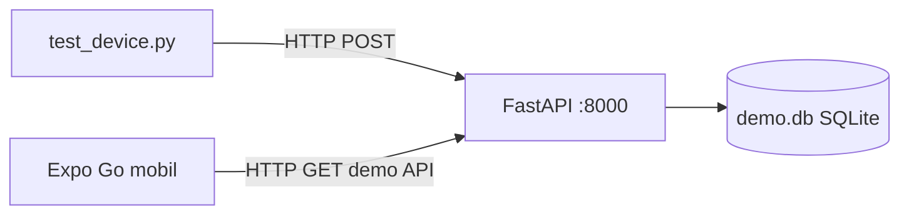

# AirSense IoT — Sektör Projesi: Hoca Kurulum Rehberi

**İlk okuma (en sade anlatım):** [README.md](README.md) — Halit Ayanlı Hocam için adım adım demo kurulumu.

Bu belge, **ESP32 veya USB donanımı olmadan** projeyi sıfırdan çalıştırmanız içindir. Simülasyon verisi `test_device.py` ile üretilir; mobil arayüz **Expo Go** ile telefonda açılır.

---

## Ne çalışacak?

| Bileşen | Görev |
|---------|--------|
| **Terminal 1** | FastAPI sunucusu (demo: yerel SQLite) |
| **Terminal 2** | `test_device.py` — sanal sensör verisi gönderir |
| **Terminal 3** | Expo — QR kod ile telefona uygulama |
| **Telefon** | Expo Go uygulaması, bilgisayarla **aynı Wi‑Fi** |



---

## 1. Gerekli yazılımlar

Bilgisayarınıza kurun:

| Yazılım | Sürüm | İndirme |
|---------|--------|---------|
| **Python** | 3.12 veya üzeri | https://www.python.org/downloads/ |
| **Node.js** | 18 LTS veya üzeri | https://nodejs.org/ |
| **Git** | (isteğe bağlı) | https://git-scm.com/ |

Telefonda:

| Uygulama | Platform |
|----------|----------|
| **Expo Go** | [Android](https://play.google.com/store/apps/details?id=host.exp.exponent) / [iOS](https://apps.apple.com/app/expo-go/id982107779) |

---

## 2. Projeyi açın

**Zip ile:** Dosyayı bir klasöre çıkarın (ör. `AirSense`).

**Git ile:**

```bash
git clone <repo-url>
cd AirSense
```

---

## 3. Demo modu kurulumu (önerilen — Supabase gerekmez)

### 3.1 Backend ortam dosyası

```bash
cd backend
cp .env.example .env
```

`.env` dosyasını düzenleyin; **en az** şunlar olsun:

```env
AIRSENSE_DEMO_MODE=true
AIRSENSE_API_SECRET=demo-local-only-change-me
```

`AIRSENSE_API_SECRET` değerini `test_device.py` ile aynı tutun (ikisi de bu dosyadan okunur).

### 3.2 Python sanal ortamı ve bağımlılıklar

```bash
chmod +x setup_venv.sh
./setup_venv.sh
```

### 3.3 Mobil ortam dosyası

```bash
cd ../mobile-app
cp .env.example .env
```

`.env` içinde:

1. Bilgisayarınızın **Wi‑Fi IP adresini** bulun (aşağıdaki Bölüm 4).
2. Şu satırları ayarlayın:

```env
EXPO_PUBLIC_DEMO_MODE=true
EXPO_PUBLIC_API_BASE_URL=http://SIZIN_IP_ADRESINIZ:8000
```

Örnek: `http://192.168.1.42:8000` — sonda `/api/...` **yazmayın**.

### 3.4 Mobil bağımlılıklar

```bash
npm install
```

---

## 4. IP adresi (telefon ↔ bilgisayar)

Telefon, veriyi bilgisayarınızdaki sunucudan alır. **Aynı Wi‑Fi ağında** olmalısınız.

**Linux / macOS:**

```bash
hostname -I
```

İlk sayıyı kullanın (ör. `192.168.1.42`).

**Windows:** `cmd` → `ipconfig` → Wi‑Fi altındaki **IPv4 Address**.

Bu IP’yi `mobile-app/.env` içindeki `EXPO_PUBLIC_API_BASE_URL` değerine yazın.

`.env` değiştirdikten sonra Expo’yu **mutlaka yeniden başlatın** ve önbelleği temizleyin:

```bash
npx expo start -c
```

---

## 5. Üç terminalde çalıştırma

### Terminal 1 — API sunucusu

```bash
cd backend
source .venv/bin/activate
uvicorn main:app --reload --host 0.0.0.0 --port 8000
```

Konsolda `[DEMO] SQLite modu aktif` benzeri bir satır görmelisiniz.

Tarayıcıda test: `http://127.0.0.1:8000/docs`

### Terminal 2 — Sanal cihaz (test_device)

```bash
cd backend
source .venv/bin/activate
python test_device.py
```

Her ~10 saniyede bir `OK:` satırı gelmelidir. Gelmiyorsa:

- Terminal 1 çalışıyor mu?
- `backend/.env` içindeki `AIRSENSE_API_SECRET` doğru mu?

### Terminal 3 — Expo (mobil)

```bash
cd mobile-app
npx expo start -c
```

Terminalde **QR kod** görünür.

---

## 6. Telefonda Expo Go ile açma

1. Telefon ve bilgisayar **aynı Wi‑Fi** ağında.
2. Telefonda **Expo Go** uygulamasını açın.
3. **Android:** Expo Go içinden QR kodu tarayın.  
   **iOS:** Kamera ile QR kodu tarayın → Expo Go’da aç deyin.
4. Uygulama yüklenince demo modda **doğrudan ana ekrana** gidersiniz (kayıt gerekmez).
5. `test_device.py` çalışıyorsa grafikler birkaç saniye içinde dolmaya başlar.

**Tunnel (farklı ağ):** Aynı Wi‑Fi mümkün değilse `npx expo start --tunnel` deneyebilirsiniz; yine de `EXPO_PUBLIC_API_BASE_URL` bilgisayarın LAN IP’si olmalıdır (telefon backend’e LAN üzerinden erişmeli).

---

## 7. Sorun giderme

| Belirti | Olası çözüm |
|---------|-------------|
| Mobilde veri yok | `test_device.py` çalışıyor mu? IP doğru mu? |
| `API_BASE_URL tanımsız` | `mobile-app/.env` oluşturuldu mu? Expo `-c` ile yeniden başlatıldı mı? |
| `401` / API key | `backend/.env` ve `test_device` aynı `AIRSENSE_API_SECRET` |
| Telefon bağlanamıyor | Firewall’da **8000** portu; aynı Wi‑Fi |
| Expo eski IP kullanıyor | `npx expo start -c` |
| Backend açılmıyor | `AIRSENSE_API_SECRET` `.env` içinde tanımlı mı? |

---

## 8. Bölüm B — Tam sistem (Supabase + kayıt)

Demo modu yerine gerçek bulut veritabanı kullanmak için:

1. `AIRSENSE_DEMO_MODE` ve `EXPO_PUBLIC_DEMO_MODE` satırlarını kaldırın veya `false` yapın.
2. Öğrenciden **`HOCA_ENV.example.txt`** şablonuna uygun dolu bir dosya isteyin (WhatsApp/e-posta — repoda **gönderilmez**).
3. İçeriği `backend/.env` ve `mobile-app/.env` dosyalarına bölün.
4. Uygulama akışı: seri numarası `AIRSENSE-PRO-001` → kayıt → giriş.

Şablon: [`HOCA_ENV.example.txt`](HOCA_ENV.example.txt)

---

## 9. Donanım

Bu demo paketinde **ESP32, USB kablo veya ngrok zorunlu değildir**. Donanım katmanı (`hardware/`) kaynak kod olarak repoda durur; çalıştırma bu rehberin kapsamı dışındadır.

---

## 10. Telif

- [LICENSE](LICENSE)
- [COPYRIGHT.md](COPYRIGHT.md)
- [NOTICE](NOTICE)

---

## Hızlı komut özeti

```bash
# Kurulum (bir kez)
cd backend && cp .env.example .env && ./setup_venv.sh
cd ../mobile-app && cp .env.example .env && npm install

# Çalıştırma (her seferinde — 3 ayrı terminal)
cd backend && source .venv/bin/activate && uvicorn main:app --reload --host 0.0.0.0 --port 8000
cd backend && source .venv/bin/activate && python test_device.py
cd mobile-app && npx expo start -c
```
